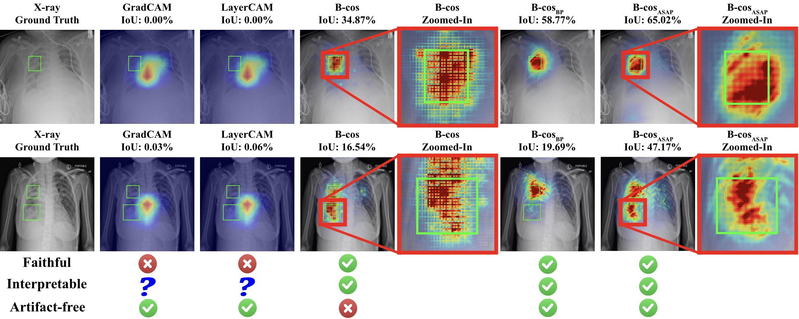

<div align="center">
  
  <h1>Faithful, Interpretable Chest X-ray Diagnosis with Artifact-free B-cos Networks</h1>
  
  <p>
    <a href="https://www.linkedin.com/in/shrebox/">Shreyash Arya</a><sup>1*</sup>,
    <a href="https://www.uni-mannheim.de/dws/people/researchers/phd-students/shashank/">Shashank Agnihotri</a><sup>2*</sup>,
    <a href="https://www.linkedin.com/in/marcel-kleinmann-195330352/">Marcel Kleinmann</a><sup>2</sup>,
    <a href="https://people.mpi-inf.mpg.de/~schiele">Bernt Schiele</a><sup>1</sup>,
    <a href="https://www.uni-mannheim.de/dws/people/professors/prof-dr-ing-margret-keuper/">Margret Keuper</a><sup>2,1</sup>
  </p>

  <p>
    <sup>1</sup> <a href="https://www.mpi-inf.mpg.de/departments/computer-vision-and-machine-learning">Max Planck Institute for Informatics, Saarland Informatics Campus, Germany</a> &nbsp;&nbsp;
    <sup>2</sup> <a href="https://www.uni-mannheim.de/dws/research/focus-groups/computer-vision-machine-learning-prof-dr-ing-margret-keuper/">Machine Learning Group, University of Mannheim, Germany</a>
  </p>

  <h3>
    <a href="https://conferences.miccai.org/2026/en/"> Medical Image Computing and Computer-Assisted Intervention (MICCAI) 2026</a>
  </h3>

  <h3>
    <a href="https://papers.miccai.org/miccai-2026/paper/3915_paper.pdf">Paper</a> |
    <a href="https://papers.miccai.org/miccai-2026/0372-Paper3915.html">Proceedings Page</a> |
    <a href="https://github.com/shrebox/Artifact-free-B-cos-Networks/">Code</a>
  </h3>
  
</div>



B-cos networks measure class evidence via feature–weight alignment, producing built-in, class-specific explanations without any post-hoc explainer. However, vanilla B-cos networks exhibit severe aliasing artifacts in their explanation maps, making them unsuitable for clinical use. We introduce anti-aliasing into the B-cos formulation through **ASAP** (Aliasing and Spectral Artifact-free Pooling) and **BlurPool**, and show that the resulting **B-cos<sub>ASAP</sub>** and **B-cos<sub>BP</sub>** models preserve diagnostic performance while delivering faithful, artifact-free explanations on both multi-class (RSNA Pneumonia) and multi-label (VinBigData) chest X-ray settings.

## Installation

### Training Environment Setup

Using `conda`:

```bash
conda env create -f environment.yml
conda activate artifact-free-bcos
```

Using `pip`:

```bash
conda create --name artifact-free-bcos python=3.12
pip install -r requirements.txt
```

#### Setting Data Paths

The two datasets are available on Kaggle: [RSNA Pneumonia Detection Challenge](https://www.kaggle.com/c/rsna-pneumonia-detection-challenge) (multi-class) and [VinBigData Chest X-ray Abnormalities](https://www.kaggle.com/c/vinbigdata-chest-xray-abnormalities-detection) (multi-label).

All dataset preprocessing — the DICOM→PNG (224×224) conversion, label tables, K-fold splits, and bounding-box CSVs (`grouped_data.csv` + split pickle for Pneumonia; `multilabel_dataset.csv`, `train224.csv`, the 5-fold split pickle, and the 224×224 bounding-box CSV for VinBigData) — follows the pipeline in the companion repository [mkleinma/B-cos-medical-paper](https://github.com/mkleinma/B-cos-medical-paper).

You can either set the paths in [`bcos/settings.py`](bcos/settings.py) or set the environment variables to point the code at your prepared data:

1. `PNEUMONIA_CSV_PATH`, `PNEUMONIA_IMAGE_FOLDER`, `PNEUMONIA_SPLITS_PATH`
2. `VINBIG_CSV_PATH`, `VINBIG_IMAGE_FOLDER`, `VINBIG_SPLITS_PATH`
3. `IMAGENET_PATH` (for B-cos backbone pretraining, optional)

* If no split pickle is provided, the Pneumonia loader falls back to a deterministic 90/10 split.

## Usage

### Training

For single-GPU training:

```bash
python train.py \
    --dataset Pneumonia \
    --base_network bcosification \
    --experiment_name <experiment_name>
```

For distributed training (SLURM via [submitit](https://github.com/facebookincubator/submitit); set `--partition` for your cluster):

```bash
python run_with_submitit.py \
    --dataset VinBigXray \
    --base_network convnext_v2 \
    --experiment_name <experiment_name> \
    --distributed --gpus 4 --nodes 1 --timeout 8 \
    --partition <your_partition>
```

* `base_network`: Pneumonia — `baseline`, `bcosification`, `convnext`; VinBigXray — `baseline`, `bcosification`, `convnext_v2`, `densenet`.
* `experiment_name`: a key in the `CONFIGS` registry in `bcos/experiments/{dataset}/{base_network}/experiment_parameters.py`, where the anti-aliasing variant (ASAP / BlurPool), pooling, and backbone are selected.

> **Naming note:** in the experiment configs and run names, the paper's **ASAP** pooling is labelled **`FLCPool`** (FLC-based anti-aliased pooling); `BlurPool` keeps its name.

### Evaluation

Classification metrics are logged during training (validation). The paper's faithfulness/localisation analysis is computed with the scripts below.

#### Localisation (EPG / IoU)

Energy Pointing Game (EPG) precision/recall and bounding-box IoU between the explanations and the ground-truth boxes. Run with `--help` for all options:

```bash
python scripts/localisation/compute_epg_pneumonia.py --help              # multi-class (Pneumonia)
python scripts/localisation/compute_epg_vinbig_combinedMethods.py --help # multi-label (VinBigData)
```

#### Qualitative Explanations

Reproduce the paper's qualitative explanation figures. Each is configured by editing the variables at the top (experiment directories under `experiments/…`, image selection) and reads ground-truth boxes via `PNEUMONIA_CSV_PATH` / `VINBIG_CSV_PATH`:

```bash
python scripts/explanation/compare_experiments_pneumonia.py   # cross-experiment / cross-method grid (e.g. B-cos vs BlurPool vs FLCPool)
python scripts/explanation/compare_experiments_vinbig.py
```

## Acknowledgements

This repository uses code from the following repositories:

* [shrebox/B-cosification](https://github.com/shrebox/B-cosification) — the base codebase this repository builds on.
* [B-cos/B-cos-v2](https://github.com/B-cos/B-cos-v2) — the B-cos formulation and the pretrained backbones our models are built upon.
* [mkleinma/B-cos-medical-paper](https://github.com/mkleinma/B-cos-medical-paper) — the dataset preprocessing pipeline.

## License

This repository's code is licensed under the Apache 2.0 license which you can find in the [LICENSE](./LICENSE) file.

The models are built on top of B-cos-v2 backbones pre-trained on ImageNet (and are hence derived from it), which is licensed under the [ImageNet Terms of access](https://image-net.org/download), which among other things only allows non-commercial use of the dataset. It is therefore your responsibility to check whether you have permission to use the pre-trained models for *your* use case.

## Citation

Please cite as follows (official MICCAI 2026 reference; the page numbers and DOI will be filled in once the proceedings appear on SpringerLink):

```tex
@InProceedings{AryShr_Faithful_MICCAI2026,
 author = {Arya, Shreyash and Agnihotri, Shashank and Kleinmann, Marcel and Schiele, Bernt and Keuper, Margret},
 title = {Faithful, Interpretable Chest X-ray Diagnosis with Artifact-Free B-cos Networks},
 booktitle = {Medical Image Computing and Computer Assisted Intervention -- MICCAI 2026},
 year = {2026},
 publisher = {Springer Nature Switzerland},
 volume = {LNCS 16882},
 month = {September},
 pages = {pending},
 url = {https://papers.miccai.org/miccai-2026/0372-Paper3915.html}
}
```
